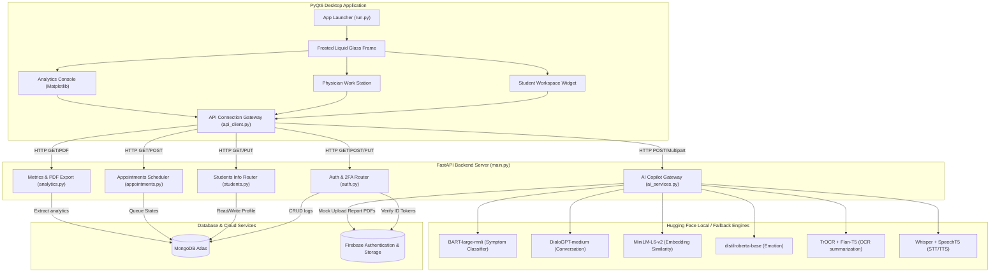
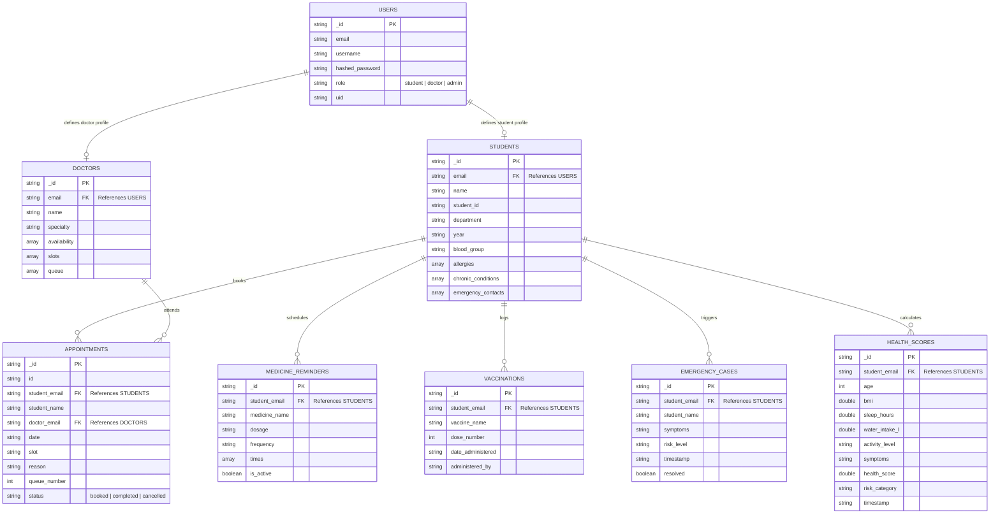
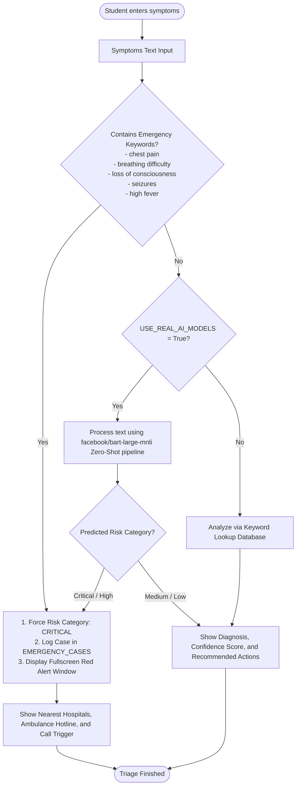

# QuadMedic - System Architecture & Database Design

This document details the software architecture, database collections schema (ER Diagram), and decision-making flowcharts for the QuadMedic smart campus healthcare ecosystem.

---

## 1. System Architecture Diagram

The system follows a split client-server design where the **PyQt6 Desktop Client** acts as a visually rich native user interface and communicates via standard HTTP REST requests to the **FastAPI Backend Core Server**.

---

## 2. Entity-Relationship (ER) Diagram (MongoDB Schema)

Although MongoDB is schemaless, QuadMedic enforces clean document models. Relationships are managed via matching fields (e.g. `student_email` or `doctor_email`).

---

## 3. Symptom Diagnosis & Emergency Triage Flowchart

This flowchart outlines the triage process for symptom classification.

